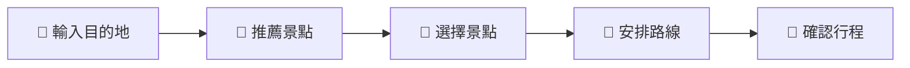
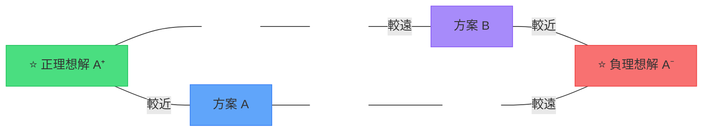
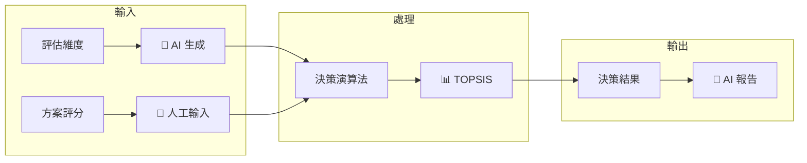
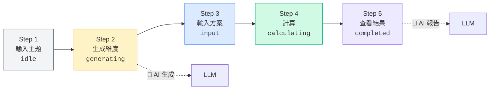
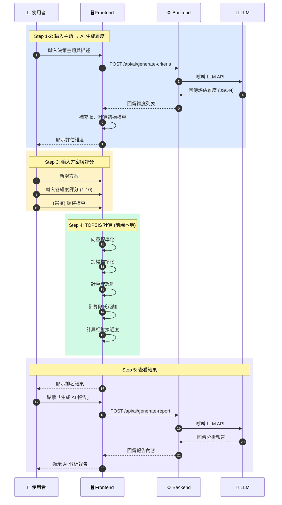

## 前言：什麼是「坑主」？

今年 DevFest  12/20 台南有一個特別的議程——「AI 落地解方共創坊」，這是一場為時 1.5 小時的互動工作坊，參與者需要從零開始發想 AI 解決方案，而我正是這場活動的「坑主」。

坑主的角色類似講者，但擁有更多的互動性。我帶著一個真實世界的問題與實作方案，引導大家一起設計解決流程。這篇文章將完整記錄這次經歷——從問題發想、工作坊設計，到最終使用 TOPSIS 演算法實作決策工具的技術細節。

## Part 1：情境提出——日常決策的困境

### 你做重要決策時，通常怎麼做？

工作坊一開始，我先做了一個現場調查：

- A. 憑直覺
- B. 列優缺點
- C. 問朋友
- D. 拖到最後一刻

你的答案是什麼？

不管選哪個，我們其實每天都在面對一個共同的挑戰：**多準則決策問題**。

舉個例子：

> 「我想買一台新筆電，但 MacBook 很貴、Dell 效能好但重、Lenovo 便宜但螢幕普通...」

當你想買房、選工作、採購設備，甚至只是選餐廳，都會遇到這種「維度相互衝突」的困境：

| 情境     | 相互衝突的維度                 |
| -------- | ------------------------------ |
| 買房     | 價格 vs 坪數 vs 交通 vs 學區   |
| 選工作   | 薪水 vs 發展性 vs 工作生活平衡 |
| 採購設備 | 成本 vs 效能 vs 維護性         |
| 選餐廳   | 距離 vs 評價 vs 價位 vs 口味   |

### 傳統做法的痛點

| 方法     | 問題                     |
| -------- | ------------------------ |
| 憑直覺   | 容易有偏見，難以說服他人 |
| 列優缺點 | 難以量化比較，無法排序   |

這就是我想解決的核心問題：**當決策涉及多個相互衝突的維度時，如何做出系統化、可解釋的最佳選擇？**

## Part 2：共創設計——讓參與者動手設計 AI 解決方案

### 設計任務

我給參與者的挑戰題目是：

> **設計一個 AI 輔助的多準則決策工具**

需求很簡單：
1. 幫助使用者做出系統化的決策
2. 結合 AI 能力降低使用門檻
3. 結果需要可解釋

每組需要產出兩樣東西：
1. **功能流程圖**：使用者從開始到得到結果的完整流程
2. **AI 介入點**：標註 AI 在哪些環節發揮作用

### AI 協作思維框架

在開始設計前，我先和參與者分享了與 AI 協作的正確心態。

**提示詞四模組**：
1. **上下文**：背景與角色設定
2. **具體指令**：明確的任務描述
3. **目標**：期望達成的結果
4. **格式**：輸出的結構與形式

另外一個很重要的概念是 **Meta Prompt**——讓 AI 當你的 Prompt 顧問，幫你設計更好的提示詞。

### LLM 協作注意事項

| 考量點   | 問題                     | 建議                     |
| -------- | ------------------------ | ------------------------ |
| API Key  | 如何保護？放前端還後端？ | 後端代理，永不暴露、BYOK |
| 可行性   | LLM 能做到嗎？成本多少？ | 先評估 token 用量        |
| 錯誤處理 | LLM 回應格式不對怎麼辦？ | 設計 fallback 機制       |

> 💡 可使用 [Google AI Studio](https://aistudio.google.com/prompts/new_chat) 測試 token 數量與調試 Prompt

### 流程圖繪製指引

我提供了一個簡單的範例讓大家參考（以旅遊規劃為例）：

重點是標記清楚：
- 🤖 代表 AI 可以幫忙的環節
- 👤 代表必須由人類判斷的環節

### 設計檢查清單

- [ ] 是否有明確的輸入與輸出？
- [ ] AI 介入點是否合理？（不要過度依賴 AI）
- [ ] 人為判斷是否保留在關鍵決策？

## Part 3：方案公開——我的技術選擇與實作

### 為什麼需要決策演算法？從秘書問題談起

在揭曉我的方案之前，我先用一個經典的問題來說明為什麼我們需要演算法：

#### **秘書問題（Secretary Problem）**
>假設你要面試 100 位秘書，每面試完一位必須立刻決定錄取或放棄，放棄後不能反悔。你該用什麼策略？

**最佳策略（37% 法則）**：
1. 先面試前 37 位，只觀察不錄取
2. 記住這 37 位中最好的標準
3. 從第 38 位開始，錄取第一個超過這個標準的人

這個問題給我們的啟發是：
- 決策需要有「基準」來比較
- 演算法可以幫我們建立科學的比較框架

但秘書問題是「單次選擇」，我們的問題是「多方案比較」——這就需要 **TOPSIS**。

## TOPSIS 演算法詳解

### 什麼是 TOPSIS？

**TOPSIS**（Technique for Order Preference by Similarity to Ideal Solution）是 1981 年由 Hwang & Yoon 提出的多準則決策分析方法。

核心思想非常直觀：**最佳方案應該離正理想解最近、離負理想解最遠**。

> **結論**：方案 A 離 A⁺ 較近 → A 是較佳選擇

### 演算法 7 步驟

| 步驟 | 說明           | 公式                                     |
| ---- | -------------- | ---------------------------------------- |
| 1    | 建立決策矩陣   | m 個方案 × n 個維度                      |
| 2    | 向量標準化     | $r_{ij} = x_{ij} / \sqrt{\sum x_{ij}^2}$ |
| 3    | 加權標準化     | $v_{ij} = w_j \times r_{ij}$             |
| 4    | 確定理想解     | Benefit 型取 max，Cost 型取 min          |
| 5    | 計算歐氏距離   | $D^+ = \sqrt{\sum(v_{ij} - v_j^+)^2}$    |
| 6    | 計算相對接近度 | $C_i = D^- / (D^+ + D^-)$                |
| 7    | 排序           | 依 Ci 降序排列                           |

### Benefit vs Cost 維度

| 維度類型                | 正理想解 (A⁺) | 負理想解 (A⁻) | 範例       |
| ----------------------- | ------------- | ------------- | ---------- |
| **Benefit**（越大越好） | max           | min           | 效能、品質 |
| **Cost**（越小越好）    | min           | max           | 價格、重量 |

### 為什麼不用加權平均？一個反直覺的例子

這是我在準備工作坊時發現的有趣案例：**同一組數據，兩種方法竟然排名相反！**

**範例資料**

| 選項 | 效能 | 價格 |
| ---- | ---: | ---: |
| A    |  100 | 1000 |
| B    |   90 |  100 |

權重：效能 **0.6**、價格 **0.4**

**加權平均法結果**（min-max 正規化）

| 選項 | 效能' | 價格' | 加權分數                |
| ---- | ----: | ----: | ----------------------- |
| A    |     1 |     0 | 0.6×1 + 0.4×0 = **0.6** |
| B    |     0 |     1 | 0.6×0 + 0.4×1 = **0.4** |

🏆 **加權平均：A > B**

**TOPSIS 結果**

| 選項 | 貼近度 C |
| ---- | -------: |
| A    |    0.111 |
| B    |    0.889 |

🏆 **TOPSIS：B > A**

**為什麼會翻盤？**

- 加權平均在只有兩選項時，容易變成「誰在高權重準則贏就贏」
- TOPSIS 會考慮「差多少」— B 的價格便宜 **10 倍**，拉近了與理想解的距離

> 🎮 **互動式圖解**：[TOPSIS vs 加權平均 差異視覺化](https://topsis-interactive-guide-347683812808.us-west1.run.app/#concept)

## 我的設計決策

### 系統設計

| 設計點   | 我的選擇              | 理由                       |
| -------- | --------------------- | -------------------------- |
| 維度生成 | **AI 生成**           | 降低認知負擔，不需專業知識 |
| 權重設定 | **初始均等 + 可調整** | 支援自動/手動兩種調整模式  |
| 評分方式 | **建議手動 1-10 分**  | 直覺易懂，保留人工判斷     |
| 計算位置 | **前端本地**          | 減少延遲                   |
| 結果解釋 | **AI 報告**           | 自然語言更易理解           |

### 5 步決策流程

## 技術架構

### 系統互動循序圖

### 技術選擇理由

| 技術選擇              | 理由                          |
| --------------------- | ----------------------------- |
| **React 19 + Vite 7** | 現代化開發體驗、快速 HMR      |
| **Express + TS**      | 前後端同語言、型別定義可互通  |
| **Vercel AI SDK**     | 多 LLM 提供商抽象層、易於切換 |
| **TOPSIS 前端計算**   | 減少 API 延遲                 |
| **shadcn/ui**         | 可客製化的 UI 元件、MCP       |

## 開發經驗與踩坑分享

### 1. API Key 安全性

**問題**：前端環境變數會暴露在瀏覽器 DevTools 中

**解決**：透過後端代理呼叫 LLM API，API key 只存在後端

**教訓**：先想清楚架構再動手。這看起來是基本常識，但趕時間的時候真的很容易踩到。

### 2. 對話紀錄的重要性

**問題**：與 AI 來回調整 prompt 時，常忘記試過什麼

**解決**：加入對話 log 記錄功能，追蹤每次 AI 呼叫的輸入輸出

**建議**：保留 log 可以知道歷史對話記錄，對於 debug 和優化 prompt 都很有幫助。

### 3. 前後端同資料夾開發

**做法**：將 frontend 與 backend 放在同一個 monorepo 中

**好處**：
- 共享 TypeScript 型別定義
- 統一版本控制與部署流程
- 開發時方便同時啟動前後端

## 結語

這次擔任坑主的經驗，原先以為內容會講不滿 1.5 個小時，沒想到有太多東西想分享，差點講不完。最有趣的是看到參與者們用不同角度思考同一個問題——有人用二分法讓 AI 輔助選擇，有人先透過人工詢問再請 AI 介入，每個人的切入點都不太一樣。

如果你對這個專案有興趣，歡迎參考[TOPSIS 互動式圖解](https://topsis-interactive-guide-347683812808.us-west1.run.app/#concept)

## 延伸閱讀與參考資料

- [Vercel AI SDK 文件](https://sdk.vercel.ai/docs)
- [shadcn/ui 文件](https://ui.shadcn.com/)
- [Mermaid - Diagramming and charting tool](https://mermaid.js.org/)
- [4 招無腦生成神級 Prompt｜泛科學院](https://www.youtube.com/watch?v=xqHUrLOJixQ)
- [Prompt 提示工程終極指南](https://www.youtube.com/watch?v=DVeJGQCycjI)
- [9 Best Prompting Frameworks to Supercharge Your Everyday Research with LLMs](https://felix-pappe.medium.com/9-best-prompting-frameworks-to-supercharge-your-everyday-research-with-llms-9b5383a3eb7a)
- [Bring your own encryption - Wikipedia](https://en.wikipedia.org/wiki/Bring_your_own_encryption)
- [選擇障礙必備的 37% 法則](https://bookzone.cwgv.com.tw/article/25295)